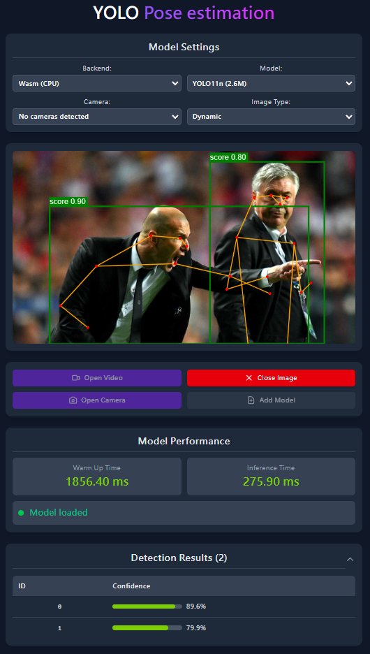

# yolo object detect onnxruntime-web



## ✨ Features

This web application built on ONNX Runtime Web implements YOLO's object detection inference capabilities

- 👤 **Pose Estimation** - Track human keypoints and poses

## 💻 Technical Support

- ⚡ **WebGPU Acceleration** - Leverage the latest Web graphics API for enhanced performance
- 🧠 **WASM (CPU)** - Provide compatibility on devices that don't support WebGPU

## 📹 Input Types Support

The application supports multiple input types for object detection:

| Input Type         |      Format      | Description                          | Use Case                                   |
| :----------------- | :--------------: | :----------------------------------- | :----------------------------------------- |
| 📷 **Image**       |     JPG, PNG     | Upload and analyze static images     | 🔍 Single image analysis, batch processing |
| 📹 **Video**       |       MP4        | Upload and process video files       | 🎬 Offline video analysis, content review  |
| 📺 **Live Camera** | Real-time stream | Use device camera for live detection | 🚀 Real-time monitoring, interactive demos |

## 📊 Available Models

| Model                                                  | Input Size | Param. |                  Best For                  | License                                                                                                  |
| :----------------------------------------------------- | :--------: | :----: | :----------------------------------------: | :------------------------------------------------------------------------------------------------------- |
| [YOLO11-N](https://github.com/ultralytics/ultralytics) |    640     |  2.6M  | 📱 Mobile devices & real-time applications | [AGPL-3.0](./public/models/LICENSE.txt) ([Ultralytics YOLO](https://github.com/ultralytics/ultralytics)) |
| [YOLO11-S](https://github.com/ultralytics/ultralytics) |    640     |  9.4M  |      🖥️ Higher accuracy requirements       | [AGPL-3.0](./public/models/LICENSE.txt) ([Ultralytics YOLO](https://github.com/ultralytics/ultralytics)) |

## 🛠️ Installation Guide

1. Clone this repository

```bash
git clone https://github.com/nomi30701/yolo-pose-estimation-onnxruntime-web.git
```

2. cd to the project directory

```bash
cd yolo-pose-estimation-onnxruntime-web-web
```

3. Install dependencies

```bash
yarn install
```

## 🚀 Running the Project

Start development server

```bash
yarn dev
```

Build the project

```bash
yarn build
```

## 🔧 Using Custom YOLO Models

To use a custom YOLO model, follow these steps:

### Step 1: Convert your model to ONNX format

Use Ultralytics or your preferred method to export your YOLO model to ONNX format. Ensure to use `opset=12` for WebGPU compatibility.

```python
from ultralytics import YOLO

# Load your model
model = YOLO("path/to/your/model.pt")

# Export to ONNX
model.export(format="onnx", opset=12, dynamic=True)
```

### Step 2: Add the model to the project

You can either:

- 📁 Copy your ONNX model file to the `./public/models/` directory
- 🔄 Upload your model directly through the `**Add model**` button in the web interface

#### Step 2-1: 📁 Copy your ONNX model file to the `./public/models/` directory

In App.jsx, Ctrl+F search 'yolo11n-2.6M'

```jsx
<select name="model-selector">
  <option value="yolo11n">yolo11n-2.6M</option>
  <option value="yolo11s">yolo11s-9.4M</option>
  <option value="your-custom-model-name">Your Custom Model</option>
</select>
```

Replace `"your-custom-model-name"` with the filename of your ONNX model.

### Step 3: Update class definitions

Update the `src/utils/yolo_classes.json` file with the class names that your custom model uses. This file should contain a dict of strings representing the class labels.

For example:

```json
{
  "class": {
    "0": "person",
    "1": "bicycle",
    "2": "car",
    "3": "motorcycle",
    "4": "airplane"
  }
}
```

Make sure the classes match exactly with those used during training of your custom model.

### Step 4: Refresh and select your new model 🎉

> 🚀 WebGPU Support
>
> Ensure you set `opset=12` when exporting ONNX models, as this is required for WebGPU compatibility.

## 📸 Image Processing Options

The web application provides two options for handling input image sizes, controlled by the `imgsz_type` setting:

- **Dynamic:**

  - When selected, the input image is used at its original size without resizing.
  - Inference time may vary depending on the image resolution; larger images take longer to process.

- **Zero Pad:**
  - When selected, the input image is first padded with zero pixels to make it square (by adding padding to the right and bottom).
  - The padded image is then resized to 640x640 pixels.
  - This option provides a balance between accuracy and inference time, as it avoids extreme scaling while maintaining a predictable processing speed.
  - Use this option for real-time applications.

> ✨ Dynamic input
>
> This requires that the YOLO model was exported with `dynamic=True` to support variable input sizes.
